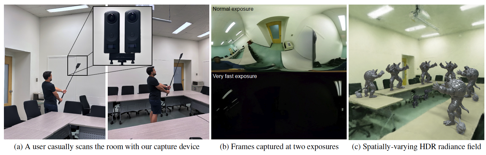

# PanDORA: Casual HDR Radiance Acquisition of Indoor Scenes for Image-based Lighting

Official code release for the paper **"PanDORA: Casual HDR Radiance Acquisition
of Indoor Scenes for Image-based Lighting"** (ICCP 2026).

- 📄 Paper: https://arxiv.org/abs/2407.06150
- 🌐 Project page: https://lvsn.github.io/pandora/



*A user casually scans a room with a dual 360° rig recording two exposures simultaneously; PanDORA reconstructs a spatially-varying HDR radiance field for realistic image-based lighting.*

PanDORA reconstructs an HDR radiance field of an indoor scene from two 360°
videos captured at different exposures. This repo lets you download a scene and
train the model with a single Docker environment.

Built on [Nerfstudio](https://github.com/nerfstudio-project/nerfstudio). The
`hdr-nerfacto` method is our implementation of
[HDR-NeRF](https://xhuangcv.github.io/hdr-nerf/) (Huang et al., CVPR 2022).

---

## Quick start

**Requirements:** an NVIDIA GPU, [Docker](https://docs.docker.com/get-docker/),
and the [NVIDIA Container Toolkit](https://docs.nvidia.com/datacenter/cloud-native/container-toolkit/latest/install-guide.html).

Everything runs inside a Docker image that this repo builds for you.

### 1. Build the image and open a shell

```bash
docker/build_and_run.sh --shell
```

The first build takes a while (it compiles a few components). After it finishes
you land in a shell inside the container. All the commands below run there.

### 2. Download a scene

```bash
docker/download_scenes.sh --list                     # see all available scenes
docker/download_scenes.sh --dest /data meeting_room  # download one (~5 GB)
```

### 3. Prepare the scene

```bash
ns-process-data lantern-openSFM \
  --data /data/meeting_room/data/ \
  --output-dir /data/meeting_room/meeting_room_ns/ \
  --metadata /data/meeting_room/sfm/reconstruction.json
```

### 4. Train

```bash
DATASET_DIR=/data/meeting_room/meeting_room_ns/ docker/run_pandora_pipeline.sh
```

Results are written under `outputs/pandora/PanDORA/`.

> Tip: for a quick test run, add `STEP1_ITERS=200 STEP2_ITERS=200` before the
> command to train only a few iterations.

---

## Advanced

The steps above cover the common case. For the full workflow — capturing your
own scenes, running OpenSFM, and computing metrics — see:

- [`README-pandora.md`](README-pandora.md) — the PanDORA pipeline in detail.
- [`README-hdrnerfacto.md`](README-hdrnerfacto.md) — the HDR-Nerfacto pipeline.

---

## Citation

```bibtex
@misc{dastjerdi2025pandoracasualhdrradiance,
  title         = {PanDORA: Casual HDR Radiance Acquisition of Indoor Scenes for Image-based Lighting},
  author        = {Mohammad Reza Karimi Dastjerdi and Dominique Tanguay-Gaudreau and Frédéric Fortier-Chouinard and Yannick Hold-Geoffroy and Nima Kalantari and Jean-François Lalonde},
  year          = {2025},
  eprint        = {2407.06150},
  archivePrefix = {arXiv},
  primaryClass  = {cs.CV},
  url           = {https://arxiv.org/abs/2407.06150}
}
```

This work builds on Nerfstudio and, for `hdr-nerfacto`, HDR-NeRF — please cite
them too:

```bibtex
@inproceedings{nerfstudio,
  title        = {Nerfstudio: A Modular Framework for Neural Radiance Field Development},
  author       = {Tancik, Matthew and Weber, Ethan and Ng, Evonne and Li, Ruilong and Yi, Brent and Kerr, Justin and Wang, Terrance and Kristoffersen, Alexander and Austin, Jake and Salahi, Kamyar and Ahuja, Abhik and McAllister, David and Kanazawa, Angjoo},
  year         = 2023,
  booktitle    = {ACM SIGGRAPH 2023 Conference Proceedings},
  series       = {SIGGRAPH '23}
}

@inproceedings{huang2022hdr,
  title        = {HDR-NeRF: High Dynamic Range Neural Radiance Fields},
  author       = {Huang, Xin and Zhang, Qi and Feng, Ying and Li, Hongdong and Wang, Xuan and Wang, Qing},
  booktitle    = {Proceedings of the IEEE/CVF Conference on Computer Vision and Pattern Recognition (CVPR)},
  pages        = {18398--18408},
  year         = {2022}
}
```
